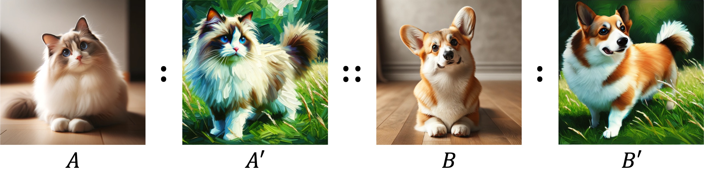

# Analogist (SIGGRAPH 2024)

[![Project](https://img.shields.io/badge/Analogist-1?label=Project&logo=data:image/svg+xml;charset=utf-8;base64,PHN2ZyB0PSIxNzEyNDkwMTA3NzIxIiBjbGFzcz0iaWNvbiIgdmlld0JveD0iMCAwIDEwMjkgMTAyNCIgdmVyc2lvbj0iMS4xIiB4bWxucz0iaHR0cDovL3d3dy53My5vcmcvMjAwMC9zdmciIHAtaWQ9IjM4NzUiIHdpZHRoPSIyMDAiIGhlaWdodD0iMjAwIj48cGF0aCBkPSJNMTAwMS40MjMyMzggNDk0LjU5MnEyMS41MDQgMjAuNDggMjIuNTI4IDQ1LjA1NnQtMTYuMzg0IDQwLjk2cS0xOS40NTYgMTcuNDA4LTQ1LjA1NiAxNi4zODR0LTQwLjk2LTE0LjMzNnEtNS4xMi00LjA5Ni0zMS4yMzItMjguNjcydC02Mi40NjQtNTguODgtNzcuODI0LTczLjcyOC03OC4zMzYtNzQuMjQtNjMuNDg4LTYwLjQxNi0zMy43OTItMzEuNzQ0cS0zMi43NjgtMjkuNjk2LTY0LjUxMi0yOC42NzJ0LTYyLjQ2NCAyOC42NzJxLTEwLjI0IDkuMjE2LTM4LjQgMzUuMzI4dC02NS4wMjQgNjAuOTI4LTc3LjgyNCA3Mi43MDQtNzUuNzc2IDcwLjY1Ni01OS45MDQgNTUuODA4LTMwLjIwOCAyNy4xMzZxLTE1LjM2IDEyLjI4OC00MC45NiAxMy4zMTJ0LTQ0LjAzMi0xNS4zNnEtMjAuNDgtMTguNDMyLTE5LjQ1Ni00NC41NDR0MTcuNDA4LTQxLjQ3MnE2LjE0NC02LjE0NCAzNy44ODgtMzUuODR0NzUuNzc2LTcwLjY1NiA5NC43Mi04OC4wNjQgOTQuMjA4LTg4LjA2NCA3NC43NTItNzAuMTQ0IDM2LjM1Mi0zNC4zMDRxMzguOTEyLTM3Ljg4OCA4My45NjgtMzguNHQ3Ni44IDMwLjIwOHE2LjE0NCA1LjEyIDI1LjYgMjQuMDY0dDQ3LjYxNiA0Ni4wOCA2Mi45NzYgNjAuOTI4IDcwLjY1NiA2OC4wOTYgNzAuMTQ0IDY4LjA5NiA2Mi45NzYgNjAuOTI4IDQ4LjEyOCA0Ni41OTJ6TTQ0Ny40MzkyMzggMzQ2LjExMnEyNS42LTIzLjU1MiA2MS40NC0yNS4wODh0NjQuNTEyIDI1LjA4OHEzLjA3MiAzLjA3MiAxOC40MzIgMTcuNDA4bDM4LjkxMiAzNS44NHEyMi41MjggMjEuNTA0IDUwLjY4OCA0OC4xMjh0NTcuODU2IDUzLjI0OHE2OC42MDggNjMuNDg4IDE1My42IDE0Mi4zMzZsMCAxOTQuNTZxMCAyMi41MjgtMTYuODk2IDM5LjkzNnQtNDUuNTY4IDE4LjQzMmwtMTkzLjUzNiAwIDAtMTU4LjcycTAtMzMuNzkyLTMxLjc0NC0zMy43OTJsLTE5NS41ODQgMHEtMTcuNDA4IDAtMjQuMDY0IDEwLjI0dC02LjY1NiAyMy41NTJxMCA2LjE0NC0wLjUxMiAzMS4yMzJ0LTAuNTEyIDUzLjc2bDAgNzMuNzI4LTE4Ny4zOTIgMHEtMjkuNjk2IDAtNDcuMTA0LTEzLjMxMnQtMTcuNDA4LTM3Ljg4OGwwLTIwMy43NzZxODMuOTY4LTc2LjggMTUyLjU3Ni0xMzkuMjY0IDI4LjY3Mi0yNi42MjQgNTcuMzQ0LTUyLjczNnQ1Mi4yMjQtNDcuNjE2IDM5LjQyNC0zNi4zNTIgMTkuOTY4LTE4Ljk0NHoiIHAtaWQ9IjM4NzYiIGZpbGw9IiNmZmZmZmYiPjwvcGF0aD48L3N2Zz4=)](https://analogist2d.github.io/)


This repository is the official implementation of Analogist.


> **Analogist: Out-of-the-box Visual In-Context Learning with Image Diffusion Model.**
> 
> Zheng Gu, Shiyuan Yang, Jing Liao, Jing Huo, Yang Gao.
>
>Visual In-Context Learning (ICL) has emerged as a promising research area due to its capability to accomplish various tasks with limited example pairs through analogical reasoning. However, training-based visual ICL has limitations in its ability to generalize to unseen tasks and requires the collection of a diverse task dataset. On the other hand, existing methods in the inference-based visual ICL category solely rely on textual prompts, which fail to capture fine-grained contextual information from given examples and can be time-consuming when converting from images to text prompts. To address these challenges, we propose Analogist, a novel inference-based visual ICL approach that exploits both visual and textual prompting techniques using a text-to-image diffusion model pretrained for image inpainting. For visual prompting, we propose a self-attention cloning (SAC) method to guide the fine-grained structural-level analogy between image examples. For textual prompting, we leverage GPT-4V's visual reasoning capability to efficiently generate text prompts and introduce a cross-attention masking (CAM) operation to enhance the accuracy of semantic-level analogy guided by text prompts. Our method is out-of-the-box and does not require fine-tuning or optimization. It is also generic and flexible, enabling a wide range of visual tasks to be performed in an in-context manner. Extensive experiments demonstrate the superiority of our method over existing approaches, both qualitatively and quantitatively.


## Set Up

First create the conda environment

```bash
conda create --name analogist python==3.10.0
conda activate analogist
```

Then install the additional requirements

```bash
pip install -r requirements.txt
```

## Run Analogist

### Visual Prompting

First prepare the input grid image for visual prompting:

```bash
python visual_prompting.py \
    --img_A example/colorization_raw/001.png \
    --img_Ap example/colorization_raw/002.png \
    --img_B example/colorization_raw/003.png \
    --output_dir example/colorization_processed
```

This will generate two images under the `output_dir` folder:
- `input.png`: $2\times2$ grid image consisting of $A$, $A'$, and $B$.
- `input_marked.png`: edited grid image with marks and arrows added.

### Textual Prompting

It is recommended to obtain an available OpenAI API and adding it into your environment:

```bash
export OPENAI_API_KEY="your-api-key-here"
```

Or you can add it directly in `textual_prompting.py`:

```python
api_key = os.environ.get('OPENAI_API_KEY', "your-api-key-here")
```

Then ask GPT-4V to get the text prompts for $B'$:

```bash
python textual_prompting.py \
    --image_path example/colorization_processed/input_marked.png \
    --output_prompt_file example/colorization_processed/prompts.txt
```

You can ask GPT-4V to generate several prompts in one request. The text prompts will be saved in `prompts.txt`, with each line shows one text prompt.

For those who do not have `OPENAI_API_KEY`, you can try publicly available vision-language models([MiniGPT](https://minigpt-4.github.io/), [LLaVA](https://llava-vl.github.io/), et al.) with `input_marked.png` as visual input and the following prompt as textual input:

> Please help me with the image analogy task: take an image A and its transformation A’, and provide any image B to produce an output B’ that is analogous to A’. Or, more succinctly: A : A’ :: B : B’. You should give me the text prompt of image B’ with no more than 5 words.

### Run the Diffusion Inpainting Model

After getting the visual prompt and textual prompt, we can take them together to run the [diffusion inpainting model](https://huggingface.co/runwayml/stable-diffusion-inpainting).

```bash
python analogist.py \
    --input_grid example/colorization_processed/input.png \
    --prompt_file example/colorization_processed/prompts.txt \
    --output_dir results/example/colorization
```


Here is another example of translating a photo into a caricature. Note that we use the same value of hyper-parameters in the quantitative evaluation. However, it is recommended to try different combinations in specific cases for better results.

```bash
python analogist.py \
    --input_grid example/caricature_processed/input.png \
    --prompt_file example/caricature_processed/prompts.txt \
    --output_dir results/example/caricature \
    --num_images_per_prompt 1 --res 1024 \
    --sac_start_layer 4 --sac_end_layer 9 \
    --cam_start_layer 4 --cam_end_layer 9 \
    --strength 0.96 --scale_sac 1.3 --guidance_scale 15
```


## Datasets

You can achieve the datasets by [huggingface](https://huggingface.co/datasets/picana/Analogist) or [onedrive](https://portland-my.sharepoint.com/:f:/g/personal/zhenggu4-c_my_cityu_edu_hk/Eh_jT6A5s6VHo7Q4GiDAKY4BjqQ3_f9MJ89qdsIEbe_K2g?e=kJY6HB).

Please put the datasets in a `datasets` folder. We also provide the GPT-4V prompts that we used in our experiments. Please see the `*_gpt4_out.txt` files.

```
Analogist
├── datasets
│   ├── low_level_tasks_processed
│   │  ├── ... 
│   │  ├── *_gpt4_out.txt
│   ├── manipulation_tasks_processed
│   │  ├── ...
│   │  ├── *_gpt4_out.txt
│   ├── vision_tasks_processed
│   │  ├── ...
│   │  ├── *_gpt4_out.txt
```

## Evaluation

Run the following script to run Analogist for these tasks.

```bash
bash evaluation.sh
```


We calculate the CLIP direction similarity to evaluate how faithfully the transformations provided by the model adhere to the transformations contained in the given examples.

```bash
python calc_clip_sim.py
```

## More Applications

### $A$ is aligned with $B$ instead of $A'$. 

In this case, the only modification is to swap the position of $A'$ and $B$ in the grid image.

```bash
python visual_prompting.py \
    --img_A example/corgi_raw/001.png \
    --img_Ap example/corgi_raw/003.png \
    --img_B example/corgi_raw/002.png \
    --output_dir example/corgi_processed
```

The other things are the same.

```bash
python analogist.py \
    --input_grid example/corgi_processed/input.png \
    --prompt_file example/corgi_processed/prompts.txt \
    --output_dir results/example/corgi \
    --num_images_per_prompt 1 --res 1024 \
    --sac_start_layer 4 --sac_end_layer 8 \
    --cam_start_layer 4 --cam_end_layer 8 \
    --strength 0.8 --scale_sac 1.3 --guidance_scale 15
```



## Related Papers

You may be interested in the following related papers:

- Diffusion Image Analogies ([code](https://github.com/subrtadel/DIA))
- Visual Prompting via Image Inpainting ([project page](https://yossigandelsman.github.io/visual_prompt/))
- Images Speak in Images: A Generalist Painter for In-Context Visual Learning ([project page](https://github.com/baaivision/Painter))
- In-Context Learning Unlocked for Diffusion Models ([project page](https://zhendong-wang.github.io/prompt-diffusion.github.io/))
- Visual Instruction Inversion: Image Editing via Visual Prompting ([project page](https://thaoshibe.github.io/visii/))
- Sequential Modeling Enables Scalable Learning for Large Vision Models ([project page](https://yutongbai.com/lvm.html))


## Acknowledgement

We borrow the code of attention control from [Prompt-to-Prompt](https://prompt-to-prompt.github.io/) and [MasaCtrl](https://ljzycmd.github.io/projects/MasaCtrl/).


## Citation

If you find our code or paper helps, please consider citing:

```bibtex
@article{gu2024analogist,
 title={Analogist: Out-of-the-box Visual In-Context Learning with Image Diffusion Model},
 author={GU, Zheng and Yang, Shiyuan and Liao, Jing and Huo, Jing and Gao, Yang},
 journal={ACM Transactions on Graphics (TOG)},
 year={2024},
}
```
