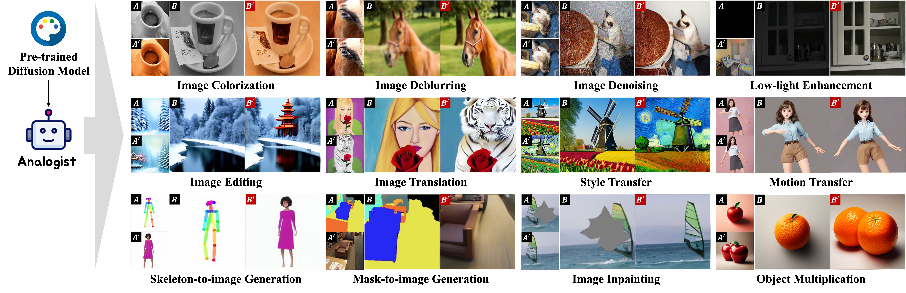

# Analogist (SIGGRAPH 2024)

This repository is the official implementation of Analogist.

> **Analogist: Out-of-the-box Visual In-Context Learning with Image Diffusion Model.**
> 
> Zheng Gu, Shiyuan Yang, Jing Liao, Jing Huo, Yang Gao.

The code will coming soon.